## Network setup

Most sensors are connected via Ethernet, therefore a few IP settings need to be
established to communicate to the sensors and outside clients.

### VI Sensor

Note: This will be obsolete once the current VI-sensor will be replaced.

VI-Sensor should not be changed from default settings (IP 11.0.0.1, expecting
computer IP 11.0.0.5). Therefore there is nothing to do. You can connect the
sensor directly to your PC and run the launch the sensor driver:

```
roslaunch visensor_node dense.launch
```
If there are any errors, please check the [troubleshooting documentation](troubleshooting_software.md).

### Robosense RS-16-LiDAR

You need a Windows PC for this procedure. You need to first set your PC to a
static IP address here:

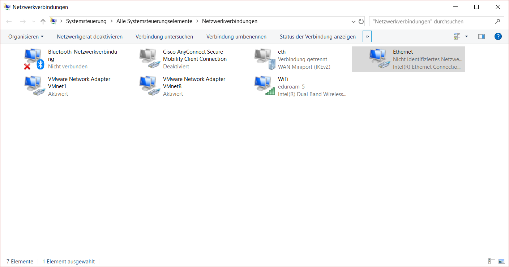
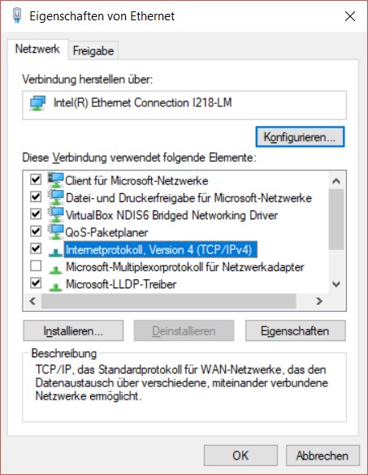

For a factory fresh Robosense LiDAR, you need to set your IP to __192.169.1
.102__ (Later in this setup, you will change this to 11.0.0.5).

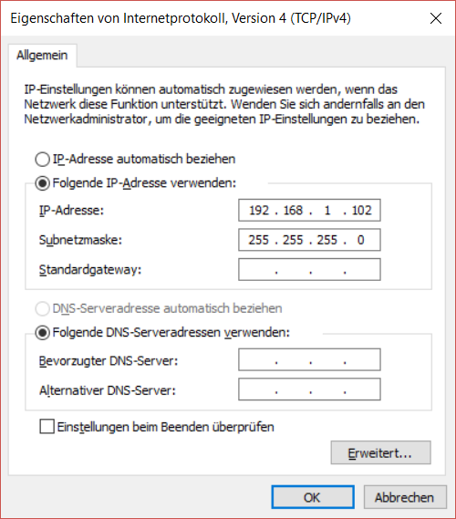

Next, you need to install and open the Robosense software RSView and connect to
the LiDAR (Via the LiDAR icon in the top panel). You should see live data in the
 viewer:

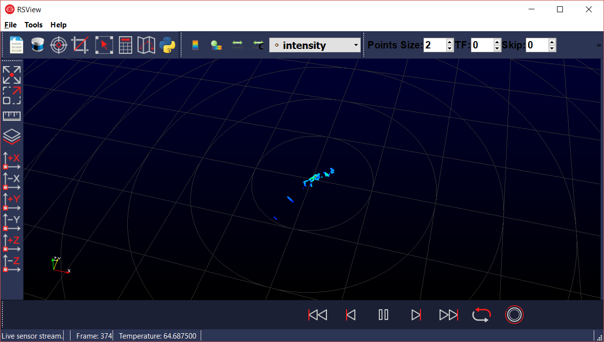

Go to Tools->RS LiDAR Information. Click Get. You should now see the current
setup of the sensor. Fill in the following IP addresses for LiDAR and PC. Also
separately make a note of the Mac address, you will need this to setup static
routing on the router later __(DO NOT FILL IN THE MAC ADDRESS FROM THIS
SCREENSHOT, JUST COPY IT!!!)__. When you are done with filling the IP addresses, hit Set LiDAR.

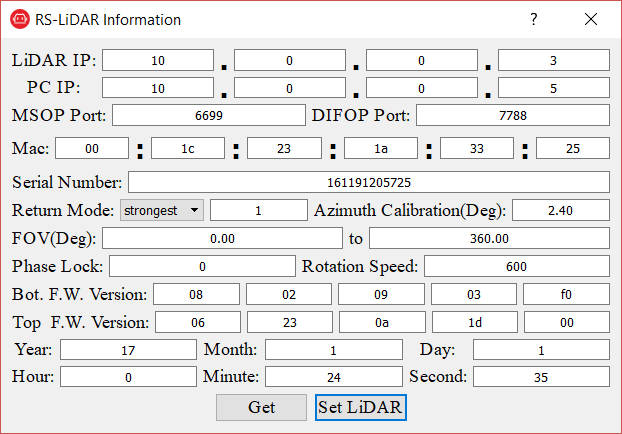

Back in Windows, change your static IP to 11.0.0.5 to see the live data
again. Check in RSView, if you can see the live data with the new IP address.

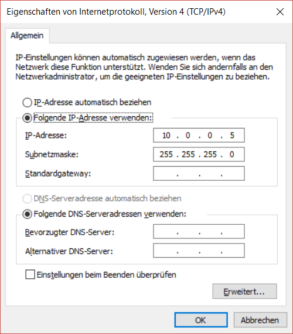

You may also have to change the IP address in the Robosense launch file (under
Linux):

```
roscd rslidar_pointcloud
vi launch/rs_lidar_16.launch
```
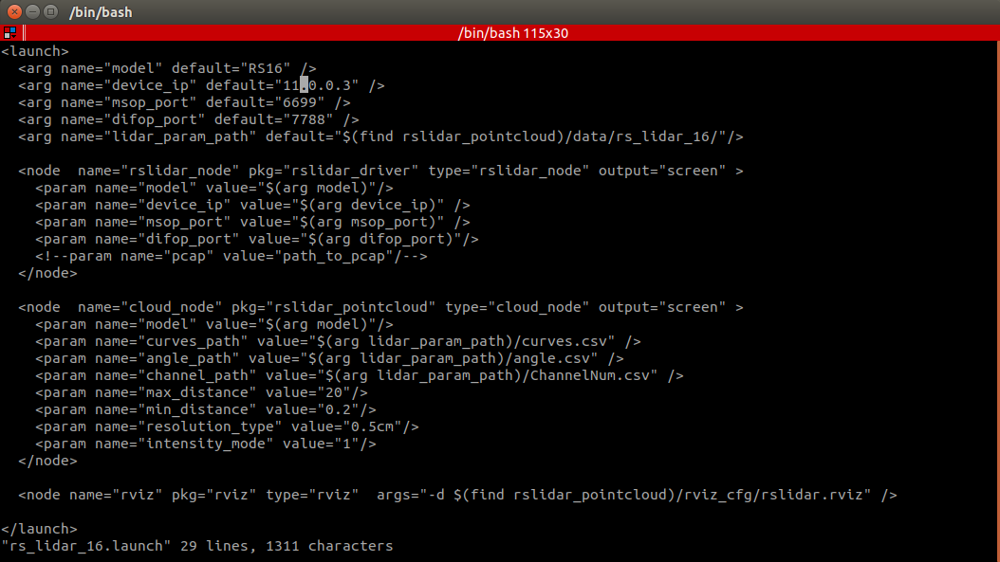

### Router (Nighthawk R7000)

Connect to the router interface by inserting the router IP address into a
browser. Next, install the custom firmware from [dd-wrt.com](https://github.com/jclehner/nmrpflash/files/2898060/dd-wrt.K3_R7000_mod.zip).

Now, configure the network via browser:
* Set IP of router

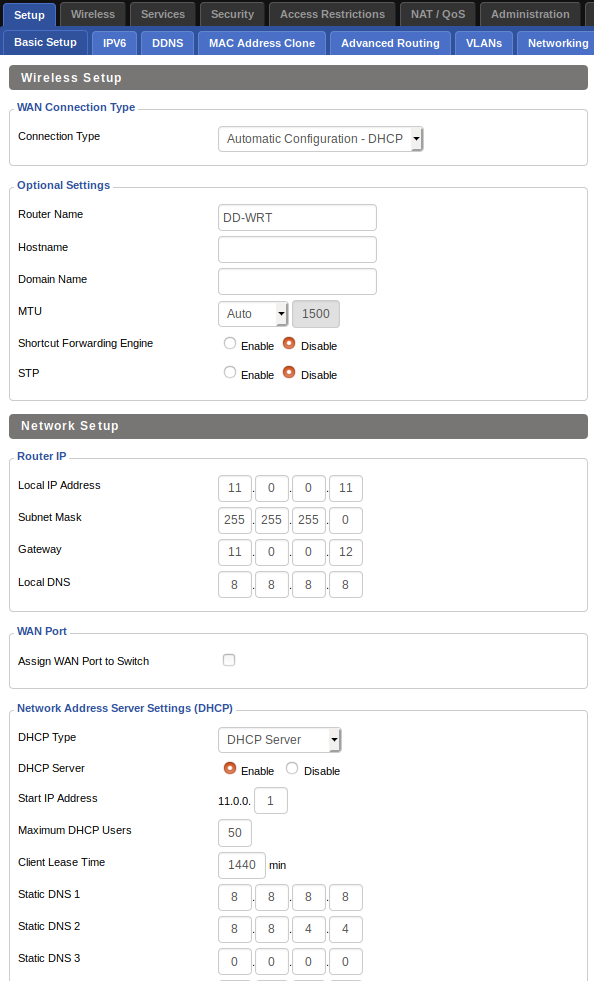
* Add static route to robosense

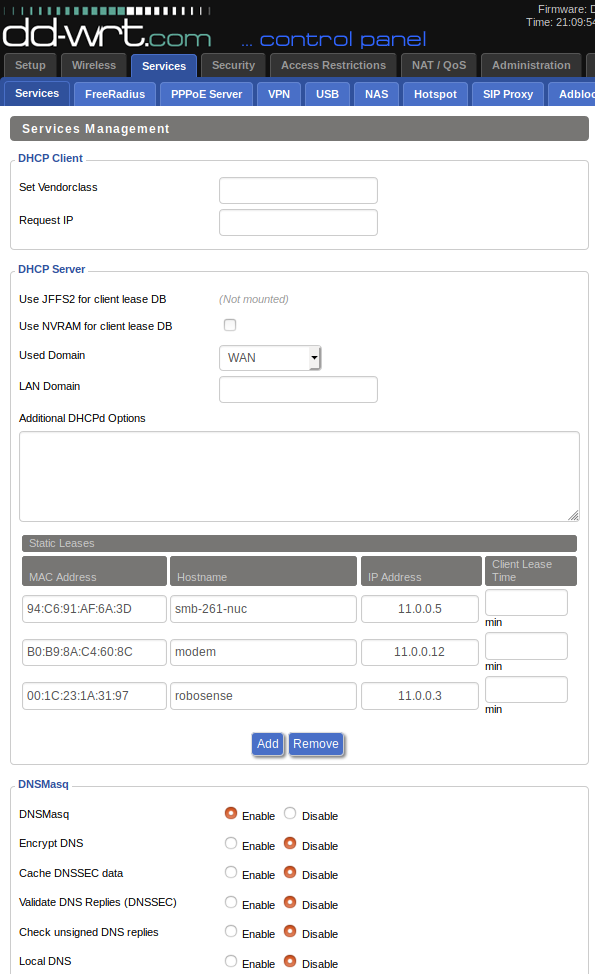
* Switch off 2.4GHz (interference with remote e-stop) and set 5GHz as DHCP
Server

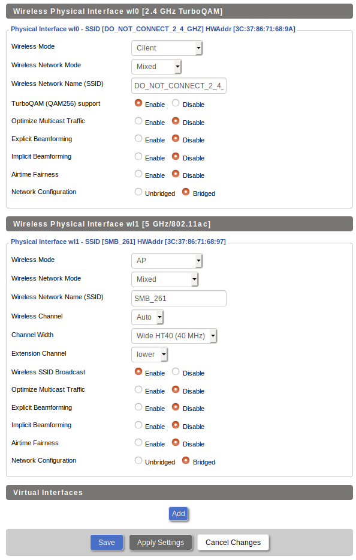
* Set passwords for Wifi:

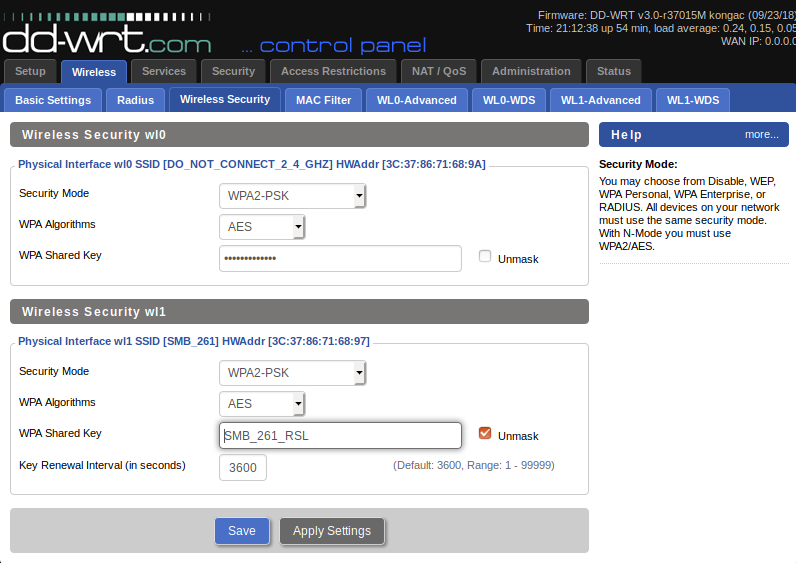
* Router user & password should be admin / admin

### Internet

Presently the 2.4 GHz channel is switched off, as it may interfere with the
remote e-stop. The next iteration will have the 2.4GHz internet channel
connected. There are however 2 further options for internet:

* Connecting an ethernet cable providing internet to the router
* Connecting a 4G modem to the router


